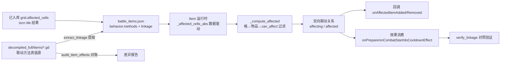

## 产品概述
本项目是《背包乱斗》(Backpack Battles) 的**外置战斗模拟器**，战斗逻辑逐行对齐已从 GDEC 加密中解密的 820 个 GDScript 源码（`decompiled_full/`）。本轮目标是在现有已跑通的模拟器基础上，做两件事：提升**效果精度**（让每个物品的效果严格对应解密源码），以及**实现物品联动**（物品间相对位置满足条件时改变彼此效果，判定逻辑同样从源码读取）。

## 核心特性
- **联动全链路**：从源码提取并还原 `Affected` 影响格（Primary/Secondary/Tertiary/Lightning 四种）、脚本覆写的 `getAffectedCellsAfterRotate`、`canAffect` 系列过滤、以及 `onAffectedItemAdded/Removed` 回调，使联动物品（磨刀石、平底锅、长笛、蒜、石袋等）能按源码语义生效
- **联动可验证**：提供"同一物品、仅改摆盘/旋转/邻居类型"的对照测试，断言效果差异与源码一致
- **效果静态对账**：以解密 GDScript 为唯一权威，建立「源码方法体 → 转译 Python → 运行时行为」三层比对，产出差异报告（不启动游戏）
- **静默失败暴露**：转译方法执行异常目前被静默吞没，需转为可统计、可归因的审计指标
- **回归基线**：固定种子的批量战斗结果基线，防止后续改动引入精度回退


## 技术栈（沿用现有，不引入新框架）
- 语言/运行时：Python 3.13（纯 Python 模拟器，无需启动游戏）
- 真值源：`decompiled_full/Items/**.gd`（820 个解密源码）、`decompiled_full/Core/Inventory.gd`
- 数据载体：`assets/battle_items.json`（518 物品，含 `grid`/`behavior`/`effects`）
- 转译管线：`simulator/extract_items.py`（GDScript → Python 源码）、`simulator/behavior.py`（运行时 exec 编译执行）
- 引擎：`simulator/combat.py` / `character.py` / `item.py` / `grid.py` / `effects.py`
- 校验工具：`tools/verify_cooldowns.py`（现仅校验冷却）、`tools/audit_effects.py`、`tools/regen_behaviors.py`

## 实现方案

### 总体策略
**先联动骨架，后效果精度**（按用户确认顺序）。联动是把"位置 → 影响格 → 过滤 → 回调 → 效果改变"这条链路打通，它是精度的最大结构性缺口；链路打通后，再用静态对账逐物品回补效果偏差。

### 关键决策与权衡
1. **联动判定必须数据驱动，禁止硬编码**
   现状 `Item._script_affected_cells()`（item.py 913–939）只硬编码了 `Potion`/`RainbowPotion`/`BagofStones` 三种脚本覆写。源码里大量物品覆写 `getAffectedCellsAfterRotate_primary/_secondary`。方案：把这些方法像 `canAffect` 一样**转译入库**，运行时由 `behavior` 调用，硬编码分支全部删除。
2. **用源码默认返回值兜底缺失谓词，而非一律 False**
   实测行为代码对"其他物品"调用了 30+ 个模拟器未实现的谓词（`canActivate` 14 次、`getPrice` 13、`canBlock` 11、`giveBuffPower` 10 …）。当前缺失会导致 `canAffect` 判定异常 → 返回 False → **联动静默失效**。方案：新增这批 API，返回值严格取自 `Item.gd` 基类默认实现（如 `canAffect` 默认 false、`canActivate` 默认 true），并保留"基类委派"（GDScript 的 `.canActivate()` 超类调用）语义。
3. **缓存语义需先查证再实现**
   `Item.gd` 用 `cachedAffectedItems`（1161–1190）缓存战斗期联动集合。需先确认原版是"战斗开始一次性缓存"（`cacheAffectedItemsForCombat`）还是放置/移除时实时刷新，再决定 `combat.run()` 中的刷新时机，避免与源码不一致。
4. **不重新解包 PCK 作为前置条件**
   全仓库 `*.tscn` 搜索结果为 0，`extracted/` 已被 .gitignore 忽略且磁盘上不存在 —— tscn 的 `CollisionMap` tile 数据当前**无法重新提取**。但已入库数据可用：`grid` 覆盖 473/518 物品，其中 `affected_cells` 273、`affected_secondary` 27、`affected_tertiary` 2、`affected_lightning` 8。因此**本轮用已入库 grid 数据 + 从 `.gd` 提取脚本覆写**（.gd 完整可得），不阻塞于重新解包；仅 45 个无 grid 物品继续用 `size` 矩形兜底。若后续需要重跑 `extract_grid.py`，须先用 `tools/pck_extractor.py` 从游戏 `.pck` 解包恢复 `extracted/Items/`（需游戏安装目录，作为可选增强，不计入本轮阻塞）。
5. **写入顺序约束（防数据丢失）**
   `simulator/build_data.py` 会重建整个 DB 并丢掉 `grid`/新增 `linkage` 字段。所有提取步骤必须**增量写入**，或在 `build_data` 之后运行，并在脚本内做字段存在性校验。

### 架构设计



### 目录结构

```
assets/
└── battle_items.json            # [MODIFY] 增量写入联动相关 behavior 方法（getAffectedCellsAfterRotate_*、
                                 #   onAffectedItemAdded/Removed、onStateChanged、getRelatedItemColumns、
                                 #   canAffect_*、affectsEmpty、isAffectingDistinct）与 linkage 元数据；
                                 #   必须增量写，禁止被 build_data 整体重建覆盖
simulator/
├── extract_items.py             # [MODIFY] 转译白名单扩展：纳入联动相关方法；保持只覆盖 behavior 字段的约定
├── extract_linkage.py           # [NEW] 联动专项提取器：扫描 Items/**.gd 覆写的联动方法，生成 linkage 清单
                                 #   （物品 → 覆写了哪些联动方法、影响格颜色、是否 distinct/affectsEmpty），
                                 #   供引擎与审计共用，避免多处重复解析源码
├── item.py                      # [MODIFY] 核心改造：删除 _script_affected_cells 硬编码改为数据驱动；
                                 #   新增 on_affected_item_added/removed、state_changed、get_related_item_columns；
                                 #   补齐被联动依赖的谓词 API（can_be_empowered/can_activate/can_block/
                                 #   is_crafted/is_class_item/gains_buffs/give_buff_power 等 30+ 项）；
                                 #   承载双向联动关系 affecting/affected
├── grid.py                      # [MODIFY] 补充 count_items_in_cells、get_items_in_cells 的 distinct 语义、
                                 #   行列关系（getRelatedItemColumns）与四邻（getAdjacentItems）辅助
├── combat.py                    # [MODIFY] _place_items 后统一构建双向联动关系；按查证后的源码语义确定
                                 #   prepare 阶段的缓存/刷新时机
└── behavior.py                  # [MODIFY] 新增严格模式：执行异常不再仅入 _failed，改为可计数上报，
                                 #   支撑精度审计；保留默认宽松模式保证既有战斗不中断
tools/
├── verify_linkage.py            # [NEW] 联动对照验证：典型联动物品（Whetstone/Pan/Flute/Garlic/BagofStones/
                                 #   Potion 及全部有 canAffect 的 211 物品）在「相邻/不相邻」「0/90/180/270 旋转」
                                 #   「邻居类型匹配/不匹配」摆盘下的效果差异断言
├── audit_item_effects.py        # [NEW] 三层静态对账：源码方法体 ↔ 转译 Python ↔ 运行时调用序列，
                                 #   输出 output/audit/effects_report.json（缺失 API、转译失败、
                                 #   静默异常、未消费方法清单）
├── regression_baseline.py       # [NEW] 固定种子批量战斗基线（output/baseline/），支持 --check 比对防回退
├── verify_cooldowns.py          # [MODIFY] 复用其单物品上场脚手架，扩展为可复用的「构造阵容并取日志」工具函数
└── audit_effects.py             # [MODIFY] 与新的 audit_item_effects 对齐，避免职责重叠
docs/
└── simulator_architecture.md    # [MODIFY] 新增联动机制章节（四种 Affected 颜色、判定/回调契约、
                                 #   linkage JSON schema），更新第 9 节「已知差距与 TODO」
README.md                        # [MODIFY] 更新「模拟器还原度」中的联动与精度声明
```

### 关键代码结构

```python
# simulator/item.py — 联动运行时对外契约（接口级）
class Item:
    def _affected_cells_abs(self, color: int = 0) -> list: ...      # tscn tile + 脚本覆写（数据驱动，删除硬编码）
    def can_affect(self, other: "Item", color: int = 0) -> bool: ... # 按 color 分发 canAffect/_secondary/_tertiary/_lightning
    def get_affected_items(self, color: int = 0) -> list: ...        # 已存在，改为消费统一构建的关系表
    def on_affected_item_added(self, other: "Item", color: int) -> None: ...   # 新增，分发行为同名方法
    def on_affected_item_removed(self, other: "Item", color: int) -> None: ... # 新增
    def state_changed(self, new_state: int) -> None: ...             # 新增，对齐 Item.setState → onStateChanged
    def get_related_item_columns(self) -> list: ...                  # 新增，行列联动（17 物品依赖）
    # 谓词补齐（默认值取自 Item.gd 基类，供 canAffect 调用）：
    def can_be_empowered(self) -> bool: ...
    def can_activate(self) -> bool: ...
    def can_block(self) -> bool: ...
    def gains_buffs(self) -> bool: ...
    def is_crafted(self) -> bool: ...
```

```jsonc
// battle_items.json 新增 linkage 片段（增量写，不覆盖其余字段）
"linkage": {
  "overrides": ["canAffect", "getAffectedCellsAfterRotate_primary", "onAffectedItemAdded"],
  "colors": { "primary": true, "secondary": false, "tertiary": false, "lightning": false },
  "distinct": false,
  "affects_empty": false,
  "script_affected": true
}
```

### 实现要点（防回归）
- **异常不再不可见**：`behavior.py` 的 `self._failed` 目前静默吞异常，是精度问题的遮掩层。新增严格模式开关（默认关闭以保证现有战斗行为不变），审计与验证工具开启，把失败方法名计入报告。
- **性能**：518 物品 × 273 带影响格物品，联动构建是 O(物品数 × 影响格数)，每场战斗仅构建一次，成本可忽略；避免在 60Hz 主循环内重复计算，一律走 `prepare` 阶段缓存。
- **改动半径**：只动 `simulator/` 与 `tools/`，不触碰外挂 AI（`core/`、`gui/`）与 `bridge/`；`battle_items.json` 采用增量写入并保留 `.bak`，便于回滚。
- **验收顺序**：先跑 `verify_linkage` 保证联动链路行为正确，再跑 `audit_item_effects` 出报告，按报告分批修复，每批结束跑 `regression_baseline --check`。


## Agent Extensions
### SubAgent
- **code-explorer**
  - 用途：在 820 个 `decompiled_full/**.gd` 文件中普查所有联动相关覆写方法（`getAffectedCellsAfterRotate_primary/_secondary`、`canAffect` 系列、`canAffect_global`、`onAffectedItemAdded/Removed/InsideAdded`、`onStateChanged`、`getRelatedItemColumns`、`affectsEmpty`、`isAffectingDistinct`），产出「物品 → 覆写方法」清单，并查证 `Item.gd` 中联动缓存的时机语义
  - 预期结果：得到联动真值清单与缓存语义结论，作为提取器与引擎实现的输入，避免逐个人工阅读 820 个文件
